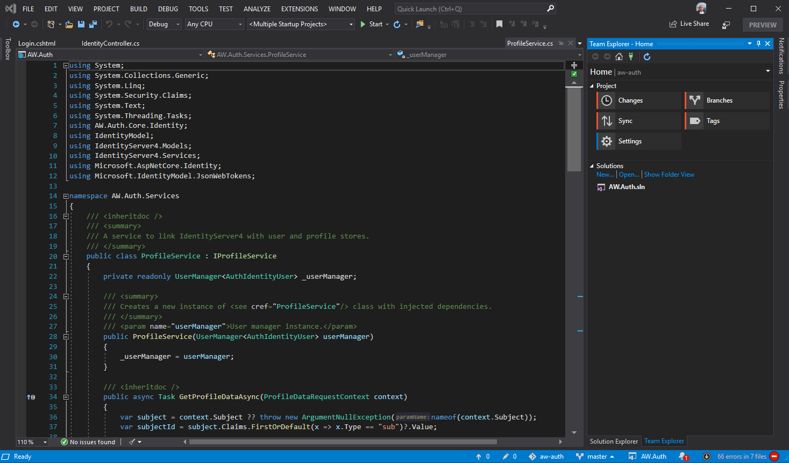
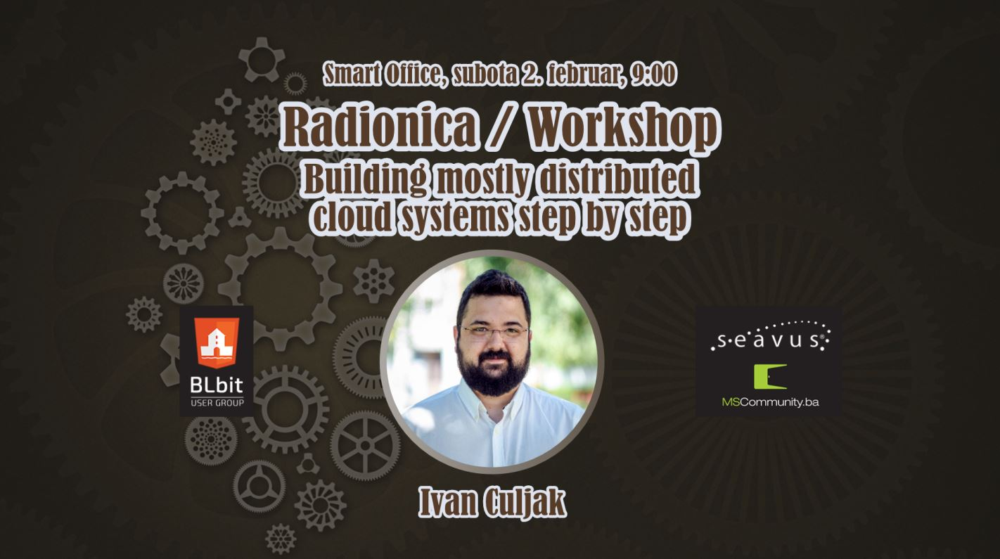
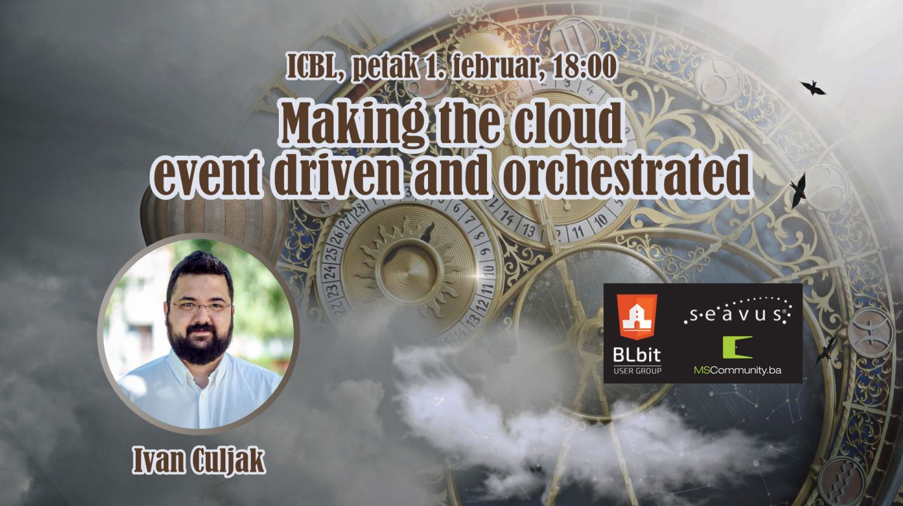

# BLbit novosti
### 01. februar 2019

---

## Novosti: .NET ekosistem

- [Visual Studio 2019 Preview 2](https://blogs.msdn.microsoft.com/visualstudio/2019/01/24/visual-studio-2019-preview-2-is-now-available/)
  - Poboljšan IDE experience - title bar, quick search, error list...
  - Novosti C#, F#, .NET, Python, containers, mobile dev...
  - https://visualstudio.microsoft.com/vs/preview/

---

## Novosti: .NET ekosistem

- [.NET Core 3.0 Preview 2](https://blogs.msdn.microsoft.com/dotnet/2019/01/29/announcing-net-core-3-preview-2/)
  - C# 8
  - Built in JSON Writer & JSON Document
  - Local .NET tools
  - WPF and Windows Forms
- [ASP.NET Core 3.0 Preview 2](https://blogs.msdn.microsoft.com/webdev/2019/01/29/aspnet-core-3-preview-2/)
  - Razor Components
  - SignalR client-to-server streaming
  - Pipes on HttpContext
  - Generic host in templates
  - Endpoint routing updates

---

## Novosti: Web i ostalo

- [Google Flutter 1.0](https://developers.googleblog.com/2018/12/flutter-10-googles-portable-ui-toolkit.html) - novi mobile cross-platform toolkit
- [Goodbye, EdgeHTML](https://blog.mozilla.org/blog/2018/12/06/goodbye-edge/) - Microsoft odustaje od sopstvenog browser engine i prelazi na Chromium
- [GitHub Free](https://github.blog/2019-01-07-new-year-new-github/) - neograničen broj privatnih repository-a
- [Collection #1](https://www.troyhunt.com/the-773-million-record-collection-1-data-reach/) - 773 miliona jedinstvenih email adresa u novom curenju podataka

---

## Community: Konferencije i meetupi

- Network 9, 27.03. - 29.03., Neum - https://www.networkkonferencija.ba/
- WinDays 19, 03.04. - 05.04., Šibenik Hrvatska - https://www.windays.hr/
- Weblica 2019, 11.05., Čakovec Hrvatska - https://weblica.hr/
- NT konferenca 24, 21.05. - 23.05., Portorož Slovenija - https://www.ntk.si/

---

## Community: BLbit

- Sutra, radionica / workshop, 9h ujutro!
- Trajanje: 5 sati, sa pauzom za ručak

---

## Community: BLbit

- Naredni meetup
  - petak, 15. februar
  - Damjan Namjesnik
  - Vue.js u praksi

---

## Današnje predavanje

